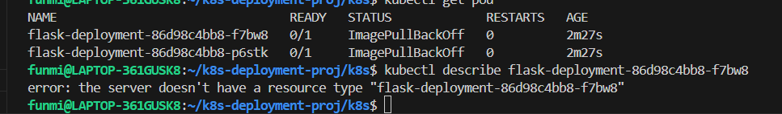

i started by inspecting the application itself, i.e the app.py file

layman
endpoint = a URL the app responds to
Think of an endpoint like a door to your app.
In web apps, the “knock” is an HTTP request, like when you type a URL in your browser.

As a DevOps engineer, an endpoint is more than just a URL — it is a specific interface your app exposes that your infrastructure can monitor, route traffic to, or scale based on.

3endpoints in the project
Health → /health tells Kubernetes if the pod is alive or ready for traffic.

Metrics → /metrics gives Prometheus data to monitor performance and trigger scaling.

Main service or homepage → / handles the normal workload traffic and tests connectivity.

in summary
“The application exposes three endpoints:

/ for normal traffic,

/health for Kubernetes to check if the pod is alive and ready,

/metrics for Prometheus to collect metrics.
These endpoints allow me to implement health checks, monitoring, and autoscaling, which are the main DevOps responsibilities.”

FROM python:3.11-alpine
WORKDIR /appso 
COPY . .
RUN pip install -r requirements.txt 
CMD python app.py

FROM python:3.11-alpine → start with Python on a tiny OS

WORKDIR /appso → set the folder inside the container for your app

COPY . . → copy all your project files into that folder

RUN pip install -r requirements.txt → install all Python dependencies

CMD python app.py → run your Flask app when the container starts

✅ In other words: “Start with Python, put my files in, install what I need, run the app.”

for a lighter Python Docker image

Use python:3.11-alpine ✅

pip install --no-cache-dir

Combine RUN commands to reduce layers

Multi-stage builds to remove build dependencies

Keep requirements.txt minimal

💡 Extra tip for DevOps interviews:

“I optimized my Docker image by using a lightweight Alpine base, minimizing layers, using pip install --no-cache-dir, and preparing for multi-stage builds to reduce final image size. This ensures faster deploys and smaller footprint in production.”

build image, then spin container
docker build -t funmishade/crona:v1
tagging as per standard

docker run -d -p 3028:3000 --name crona-app funmishade/crona:v1

docker run -p 3028:3000 funmishade/crona:v1

"I want to write the Kubernetes manifests myself rather than being given them. For this app, how do I determine which Kubernetes objects are actually needed? I know a Deployment is required, but I’m unsure if objects like Secrets or ConfigMaps are necessary. What should I look for in the application to decide which objects to create?"

Start with what your app actually does

Look at your Flask app (app.py) and the files in the project. Ask yourself:

Does it store any sensitive information?

DB passwords, API keys, tokens → need Secret

No secrets? ✅ You don’t need a Secret yet

Does it read/write files to disk?

Local disk persistence → might need a PersistentVolume and PersistentVolumeClaim

Your app is stateless → no PV needed

Does it need configuration outside of code?

Environment variables, config files → could use ConfigMap

Right now, simple Flask app → you can skip ConfigMap

Does it accept incoming traffic?

Your /, /health, /metrics endpoints → need a Service to expose Pods

Do you want multiple replicas?

If yes → you need a Deployment (or ReplicaSet)

If scaling → HPA (Horizontal Pod Autoscaler)

Do you want Kubernetes to auto-check if it’s alive?

Yes → add livenessProbe and readinessProbe in Deploymentcd ..

1️⃣ Header comments
# ==============================================
# Deployment for Flask App
# ==============================================

Just a comment to explain what this YAML is for.

Helps anyone reading the file understand that this section defines a Deployment for your Flask app.

2️⃣ apiVersion and kind
apiVersion: apps/v1
kind: Deployment

apiVersion: tells Kubernetes which API version this object uses.

apps/v1 is the standard for Deployments.

kind: specifies the type of object — here it’s a Deployment, which manages pods and ensures the right number of replicas are running.

3️⃣ Metadata
metadata:
  name: flask-deployment
  labels:
    app: flask-app

name: a unique name for the Deployment in the cluster.

labels: key-value tags assigned to the Deployment itself.

In this case: app=flask-app

Labels help identify and group resources.

4️⃣ Spec – High-level Deployment spec
spec:
  replicas: 2
  selector:
    matchLabels:
      app: flask-app

replicas: 2 → tells Kubernetes to keep 2 pods running for this Deployment.

selector.matchLabels → this tells the Deployment:

“I manage all pods that have the label app=flask-app.”

Important: The pods created by this Deployment must have matching labels in template.metadata.labels.

5️⃣ Pod template
  template:
    metadata:
      labels:
        app: flask-app

This is the template for pods the Deployment will create.

The labels here must match the selector above, otherwise Kubernetes won’t know these pods belong to this Deployment.

6️⃣ Containers
    spec:
      containers:
      - name: flask-container
        image: funmishade/crona:v1
        ports:
        - containerPort: 3000

containers: list of containers in the pod (you can have multiple).

name: internal container name.

image: Docker image to run (your Flask app).

ports: the port your container exposes (Flask is listening on 3000).

7️⃣ Liveness probe
        livenessProbe:
          httpGet:
            path: /health
            port: 3000
          initialDelaySeconds: 5
          periodSeconds: 10

Liveness probe checks if the pod is alive.

Kubernetes will restart the pod if this probe fails.

httpGet: Kubernetes will send an HTTP GET request to /health on port 3000.

initialDelaySeconds: wait 5s after pod starts before checking.

periodSeconds: check every 10s.

8️⃣ Readiness probe
        readinessProbe:
          httpGet:
            path: /health
            port: 3000
          initialDelaySeconds: 3
          periodSeconds: 5

Readiness probe checks if the pod is ready to serve traffic.

If this fails, Kubernetes won’t send traffic to this pod via Service.

Similar settings as liveness probe, but usually shorter delays to detect readiness quickly.

9️⃣ Resource requests and limits
        resources:
          requests:
            cpu: 100m
            memory: 128Mi
          limits:
            cpu: 500m
            memory: 512Mi

requests: minimum resources Kubernetes guarantees for the pod.

cpu: 100m → 0.1 CPU

memory: 128Mi → 128 MB RAM

limits: maximum resources the pod can use.

If the pod tries to exceed limits, it may be throttled or killed.

Important for HPA (Horizontal Pod Autoscaler) to know when to scale.

✅ Summary

Deployment creates & manages pods.

Labels + selectors link Deployment, Service, and HPA together.

Liveness/readiness probes keep pods healthy and ready.

Resource requests/limits help with scaling and resource management.

errors encountered

NAME                                READY   STATUS             RESTARTS   AGE
flask-deployment-86d98c4bb8-f7bw8   0/1     ImagePullBackOff   0          2m27s
flask-deployment-86d98c4bb8-p6stk   0/1     ImagePullBackOff   0          2m27s