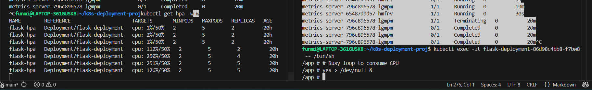
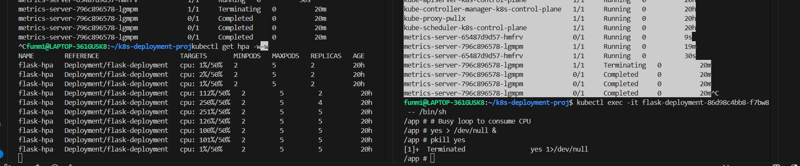
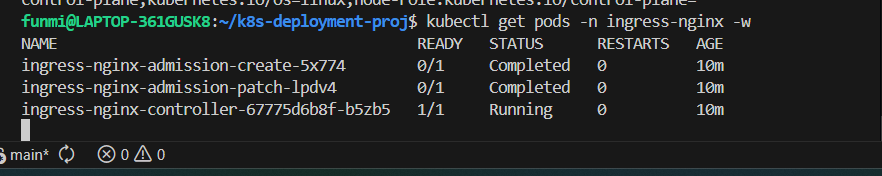

i started by inspecting the application itself, i.e the app.py file

layman
endpoint = a URL the app responds to
Think of an endpoint like a door to your app.
In web apps, the “knock” is an HTTP request, like when you type a URL in your browser.

As a DevOps engineer, an endpoint is more than just a URL — it is a specific interface your app exposes that your infrastructure can monitor, route traffic to, or scale based on.

3endpoints in the project
Health → /health tells Kubernetes if the pod is alive or ready for traffic.

Metrics → /metrics gives Prometheus data to monitor performance and trigger scaling.

Main service or homepage → / handles the normal workload traffic and tests connectivity.

in summary
“The application exposes three endpoints:

/ for normal traffic,

/health for Kubernetes to check if the pod is alive and ready,

/metrics for Prometheus to collect metrics.
These endpoints allow me to implement health checks, monitoring, and autoscaling, which are the main DevOps responsibilities.”

FROM python:3.11-alpine
WORKDIR /appso 
COPY . .
RUN pip install -r requirements.txt 
CMD python app.py

FROM python:3.11-alpine → start with Python on a tiny OS

WORKDIR /appso → set the folder inside the container for your app

COPY . . → copy all your project files into that folder

RUN pip install -r requirements.txt → install all Python dependencies

CMD python app.py → run your Flask app when the container starts

✅ In other words: “Start with Python, put my files in, install what I need, run the app.”

for a lighter Python Docker image

Use python:3.11-alpine ✅

pip install --no-cache-dir

Combine RUN commands to reduce layers

Multi-stage builds to remove build dependencies

Keep requirements.txt minimal

💡 Extra tip for DevOps interviews:

“I optimized my Docker image by using a lightweight Alpine base, minimizing layers, using pip install --no-cache-dir, and preparing for multi-stage builds to reduce final image size. This ensures faster deploys and smaller footprint in production.”

build image, then spin container
docker build -t funmishade/crona:v1
tagging as per standard

docker run -d -p 3028:3000 --name crona-app funmishade/crona:v1

docker run -p 3028:3000 funmishade/crona:v1

"I want to write the Kubernetes manifests myself rather than being given them. For this app, how do I determine which Kubernetes objects are actually needed? I know a Deployment is required, but I’m unsure if objects like Secrets or ConfigMaps are necessary. What should I look for in the application to decide which objects to create?"

Start with what your app actually does

Look at your Flask app (app.py) and the files in the project. Ask yourself:

Does it store any sensitive information?

DB passwords, API keys, tokens → need Secret

No secrets? ✅ You don’t need a Secret yet

Does it read/write files to disk?

Local disk persistence → might need a PersistentVolume and PersistentVolumeClaim

Your app is stateless → no PV needed

Does it need configuration outside of code?

Environment variables, config files → could use ConfigMap

Right now, simple Flask app → you can skip ConfigMap

Does it accept incoming traffic?

Your /, /health, /metrics endpoints → need a Service to expose Pods

Do you want multiple replicas?

If yes → you need a Deployment (or ReplicaSet)

If scaling → HPA (Horizontal Pod Autoscaler)

Do you want Kubernetes to auto-check if it’s alive?

Yes → add livenessProbe and readinessProbe in Deploymentcd ..

1️⃣ Header comments
# ==============================================
# Deployment for Flask App
# ==============================================

Just a comment to explain what this YAML is for.

Helps anyone reading the file understand that this section defines a Deployment for your Flask app.

2️⃣ apiVersion and kind
apiVersion: apps/v1
kind: Deployment

apiVersion: tells Kubernetes which API version this object uses.

apps/v1 is the standard for Deployments.

kind: specifies the type of object — here it’s a Deployment, which manages pods and ensures the right number of replicas are running.

3️⃣ Metadata
metadata:
  name: flask-deployment
  labels:
    app: flask-app

name: a unique name for the Deployment in the cluster.

labels: key-value tags assigned to the Deployment itself.

In this case: app=flask-app

Labels help identify and group resources.

4️⃣ Spec – High-level Deployment spec
spec:
  replicas: 2
  selector:
    matchLabels:
      app: flask-app

replicas: 2 → tells Kubernetes to keep 2 pods running for this Deployment.

selector.matchLabels → this tells the Deployment:

“I manage all pods that have the label app=flask-app.”

Important: The pods created by this Deployment must have matching labels in template.metadata.labels.

5️⃣ Pod template
  template:
    metadata:
      labels:
        app: flask-app

This is the template for pods the Deployment will create.

The labels here must match the selector above, otherwise Kubernetes won’t know these pods belong to this Deployment.

6️⃣ Containers
    spec:
      containers:
      - name: flask-container
        image: funmishade/crona:v1
        ports:
        - containerPort: 3000

containers: list of containers in the pod (you can have multiple).

name: internal container name.

image: Docker image to run (your Flask app).

ports: the port your container exposes (Flask is listening on 3000).

7️⃣ Liveness probe
        livenessProbe:
          httpGet:
            path: /health
            port: 3000
          initialDelaySeconds: 5
          periodSeconds: 10

Liveness probe checks if the pod is alive.

Kubernetes will restart the pod if this probe fails.

httpGet: Kubernetes will send an HTTP GET request to /health on port 3000.

initialDelaySeconds: wait 5s after pod starts before checking.

periodSeconds: check every 10s.

8️⃣ Readiness probe
        readinessProbe:
          httpGet:
            path: /health
            port: 3000
          initialDelaySeconds: 3
          periodSeconds: 5

Readiness probe checks if the pod is ready to serve traffic.

If this fails, Kubernetes won’t send traffic to this pod via Service.

Similar settings as liveness probe, but usually shorter delays to detect readiness quickly.

9️⃣ Resource requests and limits
        resources:
          requests:
            cpu: 100m
            memory: 128Mi
          limits:
            cpu: 500m
            memory: 512Mi

requests: minimum resources Kubernetes guarantees for the pod.

cpu: 100m → 0.1 CPU

memory: 128Mi → 128 MB RAM

limits: maximum resources the pod can use.

If the pod tries to exceed limits, it may be throttled or killed.

Important for HPA (Horizontal Pod Autoscaler) to know when to scale.

✅ Summary

Deployment creates & manages pods.

Labels + selectors link Deployment, Service, and HPA together.

Liveness/readiness probes keep pods healthy and ready.

Resource requests/limits help with scaling and resource management.

errors encountered

NAME                                READY   STATUS             RESTARTS   AGE
flask-deployment-86d98c4bb8-f7bw8   0/1     ImagePullBackOff   0          2m27s
flask-deployment-86d98c4bb8-p6stk   0/1     ImagePullBackOff   0          2m27s

Key difference (THIS is interview gold)
Probe Type	If it fails	Kubernetes Action
Liveness	App is broken	🔁 Restart container
Readiness	App not ready	🚫 Stop traffic
Startup (optional)	App still booting	⏳ Delay other probes

test phase
kubectl exec -it flask-deployment-86d98c4bb8-f7bw8 -- /bin/sh

Generate CPU load inside a pod

Pick a pod name, then run:

kubectl exec -it <pod-name> -- /bin/sh

Example:

kubectl exec -it flask-deployment-86d98c4bb8-f7bw8 -- /bin/sh

Inside the pod, run:

# Busy loop to consume CPU
yes > /dev/null &

yes > /dev/null & → uses 100% CPU for one thread

You can run multiple of these to increase CPU load further

Run top to see CPU usage inside the pod

⚠️ Stop the load when done with:

pkill yes

3️⃣ Watch HPA scale your pods

In a different terminal, watch the HPA:

kubectl get hpa -w

You should see CPU usage start appearing (instead of <unknown>)

When CPU exceeds the HPA target (50% in your config), replicas increase automatically

After removing the CPU load, HPA will scale pods back down

4️⃣ Clean up

After testing:

kubectl exec -it <pod-name> -- /bin/sh
pkill yes
exit

Ensure all extra pods are terminated by HPA scaling back to minReplicas

2️⃣ Implications

HPA monitors metrics (CPU, memory, or custom) and adjusts replicas automatically.

Your CPU target is 50%, but pods hit 250% → HPA added more pods to handle the load.

Scaling up: more pods → load gets shared → CPU per pod drops → back to or below 50%.

Scaling down: when load decreases, HPA removes extra pods → resource efficiency.

Basically, HPA ensures your app uses just enough resources to handle traffic, and you don’t overprovision.

3️⃣ How to interpret the numbers

cpu: 112%/50% → you’re slightly above target → might scale up 1 pod if needed.

cpu: 250%/50% → way above target → HPA scaled to max 5 pods.

Once load drops, cpu decreases → HPA will reduce replicas down to minPods=2.

4️⃣ Why this is important for you

Shows your Kubernetes cluster can automatically handle spikes.

Validates that metrics-server and HPA are working correctly.

Helps save cost/resources in real environments.

Confirms your Flask app manifests (resources, probes, HPA) are correctly configured.

1️⃣ NGINX = the receptionist

Sits at the front door of the building

Looks at each visitor and asks:

“Which shop do you want?” (/ → Flask, /health → Flask health check)

“Are you coming safely?” (HTTPS = locked letter)

Sends the visitor to the correct shop

2️⃣ LoadBalancer / VPC = the building entrance & roads

The building is in a city (cloud network)

Roads = VPC / route tables / NAT gateways

LoadBalancer = the main door of the building with an address everyone can find

NGINX = receptionist inside the building, not the roads

3️⃣ HTTPS / TLS = sealed letters

Visitors send letters that are locked (encrypted) for security

NGINX opens the letter at the door and delivers the message to your shop safely

Your shop doesn’t need to worry about opening letters — NGINX does it

4️⃣ Scaling / multiple replicas = more shops

If you open 3 identical shops (3 pods), NGINX can split visitors among them

No shop gets too crowded → traffic handled smoothly

1️⃣ NGINX = the receptionist → Ingress Controller / Reverse Proxy

In DevOps terms: NGINX Ingress Controller is a reverse proxy that routes external traffic into the cluster.

It inspects HTTP requests (host, path, headers) and forwards them to the correct Kubernetes Service.

It can also handle:

TLS termination (HTTPS)

Path-based routing (/health, /api, /)

Load balancing across multiple pod replicas

2️⃣ LoadBalancer / VPC = cloud network & traffic delivery

VPC = isolated network in cloud (AWS, GCP, Azure)

Subnets / Route Tables / NAT = traffic rules and paths inside your network

LoadBalancer = publicly accessible IP address that directs traffic to your cluster

NGINX sits behind the LB to decide where traffic goes inside the cluster

3️⃣ HTTPS / TLS = encrypted traffic handled at the edge

HTTPS = encryption of traffic for security

TLS termination at NGINX means:

NGINX decrypts traffic at the edge

Pods receive normal HTTP traffic → simpler app configuration

This is standard in production because apps don’t need to manage certificates themselves

tls:
- hosts:
  - myapp.local
  secretName: myapp-tls-secret
NGINX uses the TLS certificate in the secret to handle HTTPS requests.

4️⃣ Scaling / multiple replicas = horizontal scaling with pods
In DevOps, you never rely on one pod in production.

Multiple replicas are created using a Deployment + HPA (Horizontal Pod Autoscaler)

NGINX load balances traffic automatically among pods

Ensures high availability and smooth handling of spikes in traffic

Example:

yaml
Copy code
apiVersion: apps/v1
kind: Deployment
spec:
  replicas: 3
  template:
    spec:
      containers:
      - name: flask
        image: my-flask-app:v1
Requests to myapp.local are split across the 3 pods by NGINX.

ngnix is cluster wide. install the controller in its own ns
kubectl apply -f https://raw.githubusercontent.com/kubernetes/ingress-nginx/controller-v1.9.1/deploy/static/provider/kind/deploy.yaml
Downloads a YAML file from the internet (the official NGINX Ingress Controller setup for kind clusters)

Applies it to your cluster — meaning Kubernetes will create:

Namespace: ingress-nginx

ServiceAccount, Roles, RoleBindings: gives the controller permissions

Deployment: runs the actual NGINX Ingress Controller pod(s)

Service: exposes the controller internally (and externally if LoadBalancer)

Why you need it

metrics-server provides the numbers; HPA makes the scaling decision and tells Kubernetes what to do.
“Implemented Kubernetes HPA using metrics-server to enable automatic scaling based on CPU utilization, r

The Ingress object (flask-ingress) you created does nothing by itself.

The Ingress Controller (NGINX) is the “engine” that reads your Ingress rules and routes traffic.

Without running the controller, requests won’t go anywhere, even if you have an Ingress.

✅ TL;DR: This command installs the NGINX Ingress Controller in your cluster, which is required to actually serve your app externally via Ingress.

In Kubernetes, Ingress is a resource like Deployment or Service — it doesn’t run code itself, it just tells the Ingress Controller how to route traffic.

1️⃣ API version & resource type
apiVersion: networking.k8s.io/v1
kind: Ingress

This declares an Ingress resource

networking.k8s.io/v1 is the stable API for Ingress

Ingress is a Layer 7 (HTTP/HTTPS) router, not a load balancer itself

👉 Think of Ingress as traffic rules, not the traffic cop.

2️⃣ Metadata
metadata:
  name: flask-ingress
  namespace: default

Names the Ingress flask-ingress

It lives in the default namespace

It will only see Services in the same namespace

⚠️ If your Service was in another namespace, this Ingress would not work.

3️⃣ Annotation (NGINX-specific behavior)
annotations:
  nginx.ingress.kubernetes.io/rewrite-target: /

This tells the NGINX Ingress Controller:

“Rewrite incoming paths to / before forwarding to the backend service”

Example:

Incoming request: http://localhost/something

Backend receives: /

👉 Very common for apps (like Flask) that don’t expect prefixed paths.

4️⃣ Spec: Routing rules
spec:
  rules:

This is where traffic routing logic is defined.

5️⃣ Host rule
- host: localhost

This means:

Only requests sent to localhost will match

Perfect for Kind / local testing

In production, this would be:

host: myapp.example.com

6️⃣ HTTP paths
http:
  paths:

Ingress supports path-based routing, e.g.:

/api

/auth

/

You’re using / (everything).

7️⃣ Path configuration
- path: /
  pathType: Prefix

path: / → match everything

Prefix means:

/

/login

/health

/anything

All traffic matches.

8️⃣ Backend service
backend:
  service:
    name: flask-service
    port:
      number: 80

This is the most important part 👇

Traffic is forwarded to:

Service name: flask-service

Service port: 80

The Service then load-balances traffic to Pods

Flow:

Browser → Ingress → Service → Pods

Big-picture: What you built

Here’s what your setup now looks like:

Client (browser / curl)
        ↓
NGINX Ingress Controller
        ↓
Ingress rules (this YAML)
        ↓
flask-service (ClusterIP)
        ↓
Flask Pods

How this relates to HPA & Metrics Server

Ingress: routes traffic

Service: load-balances traffic

Metrics Server: provides CPU/memory metrics

HPA: watches metrics and scales Pods

So when traffic increases:

Ingress sends more requests

Pods use more CPU

Metrics Server reports CPU usage

HPA scales Pods up

Service spreads traffic across new Pods

🔥 This is a complete production-style flow

1️⃣ What Ingress actually is (plain English)

Ingress is NOT something that receives traffic.

👉 Ingress is just a set of rules that say:

“When an HTTP/HTTPS request comes in with
this host and this path, send it to this Service.”

Think of Ingress like a traffic rule book, not a traffic cop.

📘 Example rule:

IF host = localhost
AND path starts with /
THEN send to flask-service on port 80

That’s it.

⚠️ Ingress does nothing by itself.

2️⃣ What an Ingress Controller does

The Ingress Controller is the actual traffic handler.

It is:

A real running application

Usually NGINX, Traefik, or HAProxy

Running as Pods inside your cluster

👉 The controller:

Watches the Kubernetes API

Reads all Ingress objects

Configures itself dynamically to follow those rules

📢 Without a controller:

Ingress YAML is ignored

Traffic never reaches your app

3️⃣ Is the Ingress Controller a YAML file?

✅ Yes — but more than one

When you ran this:

kubectl apply -f https://raw.githubusercontent.com/kubernetes/ingress-nginx/controller-v1.9.1/deploy/static/provider/kind/deploy.yaml

You installed many things at once:

That single command created:

Namespace: ingress-nginx

Deployment: ingress-nginx-controller

Service: exposes the controller

ConfigMaps

RBAC (roles, bindings)

Admission webhooks

📌 You did not write these YAMLs yourself
You installed a prebuilt controller

That’s normal. No one writes these by hand.

sonarqube reuires openjdk 11/17 and a db usually posgres is used often
1️⃣ Why SonarQube requires OpenJDK 11/17

SonarQube is a Java application — it’s built in Java.

Java apps need a Java Virtual Machine (JVM) to run.

OpenJDK 11 or 17 are the supported versions for SonarQube.

Earlier versions (<11) may lack features or security fixes.

Later versions (>17) may not be fully compatible.

TL;DR: Without Java (JDK 11/17), SonarQube cannot start at all.

2️⃣ Why PostgreSQL is often used

SonarQube stores all of its data in a relational database, including:

Project metadata (names, keys, branches)

Analysis results (metrics, code smells, bugs, vulnerabilities)

Users and permissions

System settings

PostgreSQL is preferred because:

Reliability & stability → it handles large datasets well

Open-source & free → easy for DevOps/CI pipelines

Recommended by SonarSource → their documentation officially supports PostgreSQL

Works well in Docker/Cloud setups → simple to configure with environment variables

Technically, MySQL, Oracle, or SQL Server also work, but PostgreSQL is the “default” and most tested.